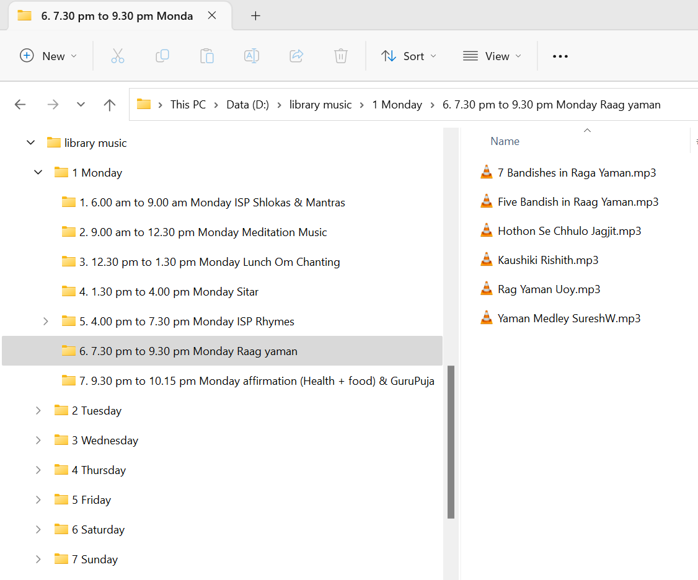

# Gurukul Music Player

### Environment Dependency
- The input folder contains music files.
- The structure of the input folder is as provided in readme_folder_screenshot.png

### How to run the code
- Run the main.py file
- The log file will be generated in the logs folder

### Run on windows
* Edit the path inside "music log.ps1" and "startr_music_player.bat"
* Place both the files on desktop.
* To auto-run, go to start>run and type "shell:startup". Place the bat file inside the startup folder.
